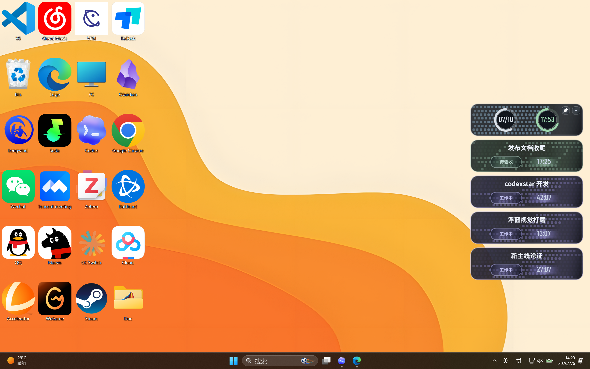
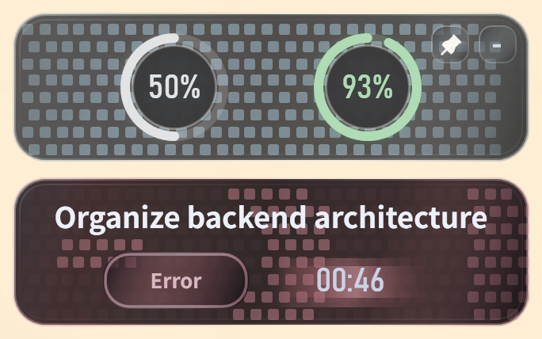
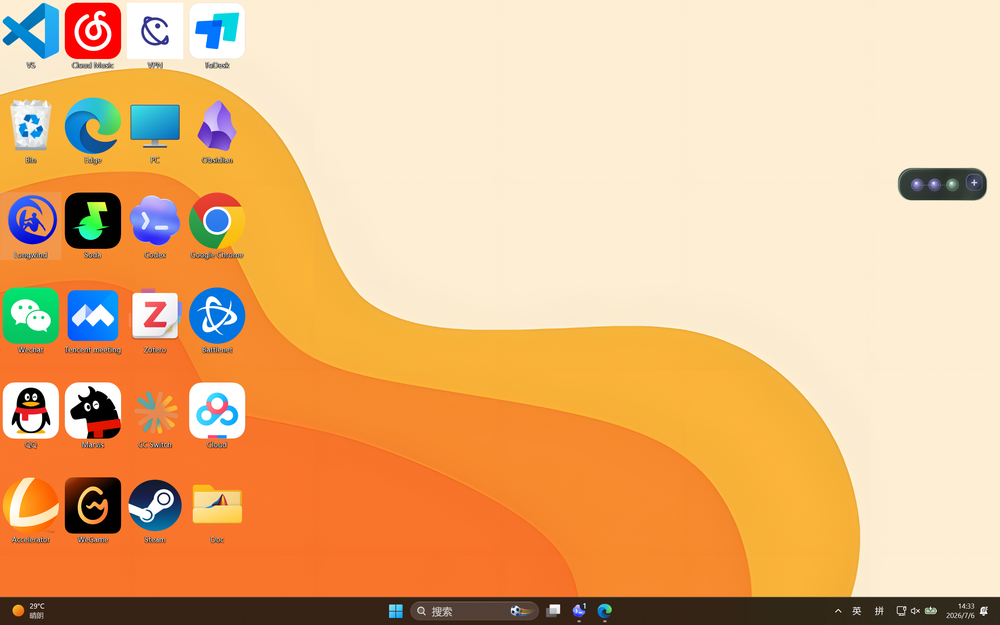
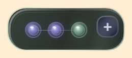
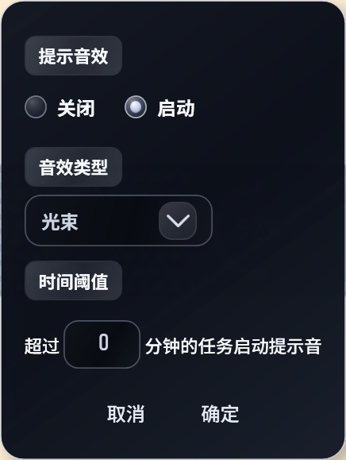
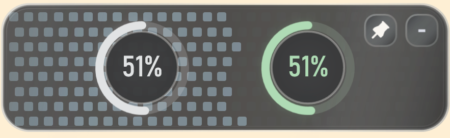

# Codexstar / codex闪星浮窗插件

Codexstar 是我给 Codex 做的 Windows 浮窗状态灯。它不试图替你工作，只负责一件小事：让你一眼知道 Codex 是在干活、等你验收，还是需要你回去看一眼。电脑托管时，人可以走开一点，焦虑少一点。

## 功能

### 1. 任务卡面模式

三种卡面颜色分别代表：工作中、完成待验收、故障待检查。像素风流动背景会跟着状态变化，远远扫一眼就知道 Codex 现在有没有在干活，不用反复切回窗口确认它是不是在摸鱼。



卡面会贴在屏幕边缘显示，每个任务一张卡，标题、状态和运行时间都放在同一个视线范围里。


中止或异常状态会单独变成红色卡面，提醒你回去看一眼；不需要保留的异常卡，也可以手动点掉。



### 2. 折叠模式

任务卡片可以折叠成一排小灯泡，一个灯泡代表一个任务。写东西、看视频、打游戏时，它不会霸占注意力；资源占用也会更低。



小灯模式只保留颜色信号：有任务、已完成、异常，都不用打开 Codex 就能看出来。



### 3. 自定义音效

内置 8 款作者精选完成提示音，可在菜单里试听和选择。也可以设置“超过几分钟才响”，短对话不至于一直叮叮当当。



### 4. 额度面

额度面可以固定，也可以松开。左边看周额度，右边看 5 小时额度；圆心内容可切换为刷新时间或剩余百分比。



### 5. 自定义大小

浮窗支持缩放。想低调，就缩小；想把电脑交给 Codex 后坐远一点看电视，就放大。它完成任务时，至少不会让你错过那一下。

## 安装

1. 打开 [最新 Release](https://github.com/StevenSong77/codexstar/releases/latest)。
2. 下载 `Codexstar-v1.1-win-x64.zip`。
3. 解压。
4. 运行 `scripts\Install-Codexstar.cmd`。

默认安装路径：

```text
%LOCALAPPDATA%\Programs\Codexstar
```

安装器会备份 `%USERPROFILE%\.codex\config.toml`，再把 Codexstar 挂到 Codex 的 `notify` hook 上。提示音由 Codexstar 播放，hook 只负责把完成事件送进来，避免重复响。

## 数据位置

Codexstar 本地状态：

```text
%LOCALAPPDATA%\Codexstar
```

默认读取 Codex 数据：

```text
%USERPROFILE%\.codex
```

如果你的 Codex 不在默认位置，可以设置：

```text
CODEX_STATUS_LIGHT_CODEX_ROOT
CODEX_STATUS_LIGHT_STATE_DIR
```

## English

Codexstar is a Windows floating status light for Codex. It keeps one thing visible: whether Codex is working, waiting for review, or asking you to come back. Less tab-switching, fewer “is it still doing anything?” moments.

## Features

### 1. Task Card Mode

Three card colors show working, review-pending, and needs-check states. The flowing pixel background makes the state readable at a glance, even when Codex is not the active window.

### 2. Collapsed Mode

Cards can collapse into small bulbs, one bulb per task. It stays visible without fighting your focus, and this mode uses fewer resources.

### 3. Custom Completion Sounds

Choose from 8 bundled completion sounds, preview them in the menu, and set a time threshold so short chats do not keep ringing.

### 4. Quota Panel

Pin or unpin the quota panel any time. The left ring shows weekly quota, and the right ring shows the five-hour quota. The center text can show either refresh time or remaining percent.


### 5. Custom Size

Scale the window down when you want silence, or make it huge when Codex is babysitting work while you watch something across the room.

## Build

```powershell
dotnet build .\CodexStatusLight.csproj -c Release
powershell -NoProfile -ExecutionPolicy Bypass -File .\scripts\Build-CodexstarRelease.ps1
```

## Notes

- Windows 10/11 x64.
- Codex Desktop should be installed under the same Windows account.
- The release package is self-contained and does not require a separate .NET runtime.
- The process name remains `CodexStatusLight.exe` for watcher and hook compatibility.
- Bundled completion sounds come from Mixkit's public free sound effects library. See `CREDITS.md`.

## License

Code is released under the MIT License. See `LICENSE`.
